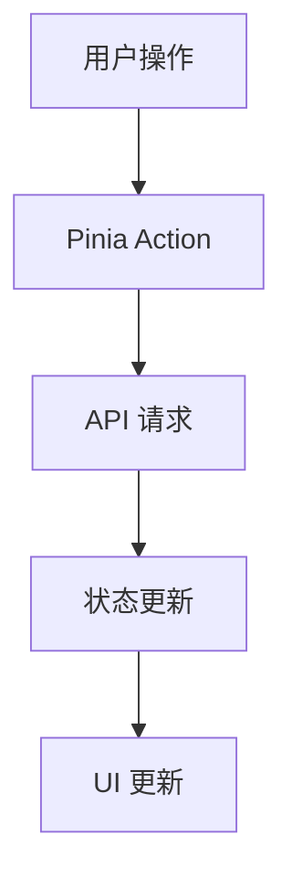

# AI创意工坊系统架构文档

## 1. 系统概述

AI创意工坊采用现代化的微前端架构，基于 uni-app 框架实现多端统一开发。系统采用 monorepo 方式管理，使用 pnpm workspace 实现多包管理，确保代码的可维护性和可扩展性。

## 2. 技术栈详解

### 2.1 核心框架
- **uni-app**: 多端开发框架，实现一次开发，多端运行
- **Vue 3**: 核心开发框架，采用 Composition API
- **TypeScript**: 类型系统，提供更好的开发体验和代码可维护性
- **Vite**: 新一代前端构建工具，提供更快的开发体验

### 2.2 状态管理
- **Pinia**: 新一代状态管理工具，替代 Vuex，提供更好的 TypeScript 支持
- **持久化存储**: 集成 uni-storage，实现数据持久化

### 2.3 UI 框架
- **uView UI**: uni-app 生态的 UI 框架
- **TailwindCSS**: 原子化 CSS 框架，提供灵活的样式管理

### 2.4 工程化工具
- **pnpm**: 高性能的包管理器
- **lerna**: monorepo 管理工具
- **ESLint**: 代码质量控制
- **Prettier**: 代码格式化
- **husky**: Git hooks 管理
- **commitlint**: 提交信息规范化

## 3. 项目结构

### 3.1 Monorepo 结构
```
packages/
├── core/                 # 核心功能包
│   ├── api/             # API 接口封装
│   ├── utils/           # 工具函数
│   └── types/           # TypeScript 类型定义
├── components/          # 组件库
│   ├── basic/          # 基础组件
│   └── business/       # 业务组件
├── hooks/              # 通用 Hooks
├── ai-services/        # AI 服务集成
│   ├── text-to-image/  # 文生图服务
│   ├── image-to-image/ # 图生图服务
│   └── image-to-video/ # 图生视频服务
└── themes/             # 主题包
```

### 3.2 应用架构
```
src/
├── pages/              # 页面文件
├── components/         # 项目组件
├── store/             # 状态管理
├── services/          # 业务服务
├── utils/             # 工具函数
└── types/             # 类型定义
```

## 4. 核心模块设计

### 4.1 AI 创作引擎
- **文本生成图像引擎**
  - 提示词优化系统
  - 风格迁移模块
  - 图像后处理模块

- **图像编辑引擎**
  - 智能抠图模块
  - 图像增强模块
  - 风格化处理模块

- **视频生成引擎**
  - 动画合成模块
  - 特效处理模块
  - 音频处理模块

### 4.2 用户系统
- 认证授权模块
- 用户信息管理
- 作品管理系统
- 收藏与分享功能

### 4.3 支付系统
- 订单管理模块
- 支付集成模块
- 计费规则引擎

## 5. 数据流设计

### 5.1 状态管理


### 5.2 数据持久化
- LocalStorage 数据存储
- 用户设置持久化
- 创作历史记录

## 6. 安全设计

### 6.1 用户认证
- JWT Token 认证
- 刷新 Token 机制
- 权限控制系统

### 6.2 数据安全
- 数据加密传输
- 敏感信息保护
- 防 XSS 攻击

## 7. 性能优化

### 7.1 加载优化
- 路由懒加载
- 组件按需加载
- 图片懒加载

### 7.2 渲染优化
- 虚拟列表
- 防抖与节流
- 组件缓存

## 8. 部署架构

### 8.1 开发环境
- 本地开发服务器
- Mock 数据服务
- 热更新支持

### 8.2 生产环境
- Nginx 反向代理
- CDN 加速
- 负载均衡

## 9. 监控与日志

### 9.1 性能监控
- 页面加载性能
- API 响应时间
- 资源加载监控

### 9.2 错误追踪
- 全局错误捕获
- API 错误监控
- 用户行为追踪

## 10. 扩展性设计

### 10.1 插件系统
- 插件注册机制
- 生命周期钩子
- 配置化扩展

### 10.2 主题系统
- 动态主题切换
- 自定义主题配置
- 主题市场支持

## 11. 开发规范

### 11.1 代码规范
- ESLint 配置
- Prettier 格式化
- TypeScript 规范

### 11.2 提交规范
- Commit Message 规范
- 分支管理策略
- Code Review 流程

## 12. 文档规范

### 12.1 代码文档
- JSDoc 注释规范
- API 文档生成
- 组件文档维护

### 12.2 项目文档
- 架构文档
- 开发指南
- 部署文档 